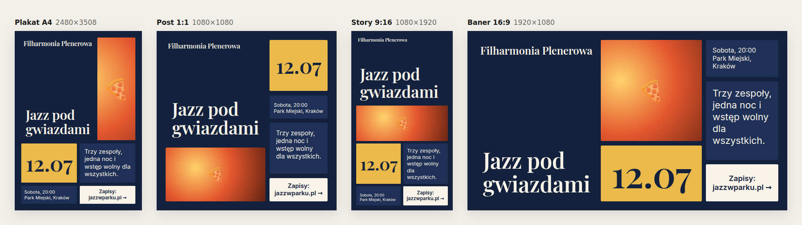

# Tilecast

**Plakaty, posty, story i banery projektowane przez Twojego agenta AI.** Tilecast to serwer MCP, skill i plugin do Claude Code. Działa też z Codex, Cursorem i każdym innym klientem MCP.

Agent pisze treść jako kafelki (nagłówek, zdjęcie, cena, szczegóły, wezwanie do działania). Tilecast układa z nich jednocześnie plakat A4, post 1:1, story 9:16 i baner 16:9. Agent dostaje podgląd wszystkich formatów jako obraz, przestawia kafelki narzędziami i eksportuje PNG w pełnej rozdzielczości oraz samodzielne pliki HTML. Wszystko powstaje z kodu frontendu (HTML/CSS), więc tekst jest zawsze poprawny, ostry i edytowalny.



## Instalacja

Do eksportu PNG potrzebny jest Node.js 20+ oraz Chrome, Chromium albo Edge. Eksport HTML działa bez przeglądarki.

### Claude Code: plugin (serwer MCP + skill)

```
/plugin marketplace add xeniak123/app
/plugin install tilecast@tilecast
```

Plugin dodaje serwer MCP `tilecast` oraz skill `/tilecast`. Skill uczy agenta, jak pisać kafelki i poprawiać projekt na podstawie podglądu. Wystarczy napisać np. „zrób plakat na koncert jazzowy w sobotę o 20:00 w Parku Miejskim”.

### Claude Code: sam serwer MCP

```bash
git clone https://github.com/xeniak123/app tilecast
claude mcp add tilecast -- node "$(pwd)/tilecast/plugin/server/tilecast-mcp.mjs"
```

### Codex

```bash
git clone https://github.com/xeniak123/app tilecast
codex mcp add tilecast -- node "$(pwd)/tilecast/plugin/server/tilecast-mcp.mjs"
mkdir -p ~/.codex/skills && cp -r tilecast/plugin/skills/tilecast ~/.codex/skills/
```

Zamiast `codex mcp add` możesz dopisać serwer ręcznie w `~/.codex/config.toml`:

```toml
[mcp_servers.tilecast]
command = "node"
args = ["/pełna/ścieżka/tilecast/plugin/server/tilecast-mcp.mjs"]
```

### Cursor i inne klienty MCP

```json
{
  "mcpServers": {
    "tilecast": {
      "command": "node",
      "args": ["/pełna/ścieżka/tilecast/plugin/server/tilecast-mcp.mjs"]
    }
  }
}
```

Jeśli repozytorium jest publiczne, zamiast klonowania możesz użyć `npx -y github:xeniak123/app` jako komendy serwera.

## Narzędzia MCP

| Narzędzie | Co robi |
| --- | --- |
| `create_design` | tworzy projekt z kafelków (albo szkic z jednego zdania) i zwraca podgląd 4 formatów |
| `update_design` | zmienia projekt: `swap_tiles`, `move_tile`, `set_tile`, `add_tile`, `remove_tile`, `set_style`, `set_palette`, `next_layout`, `set_layout` |
| `preview_design` | podgląd wszystkich formatów albo jednego w większym rozmiarze |
| `export_design` | PNG (plakat 2480×3508 w 300 dpi, 1080×1080, 1080×1920, 1920×1080) + samodzielny HTML z animacją wejścia |
| `list_designs`, `get_design` | lista zapisanych projektów i pełny JSON projektu |

Projekty zapisują się w folderze projektu jako `tilecast/<id>.tilecast.json`, więc można je commitować. Eksport trafia do `tilecast/export/<id>/` albo do wskazanego folderu w projekcie, np. `public/promo` w aplikacji webowej. Zdjęcia i logo agent podaje ścieżką (`image_path`), a trafiają do projektu jako osadzone dane.

Zmienne środowiskowe (opcjonalne):
- `TILECAST_CHROME`: ścieżka do przeglądarki, jeśli nie zostanie znaleziona automatycznie,
- `TILECAST_PROJECT_DIR`: folder projektu. Domyślnie `CLAUDE_PROJECT_DIR`, a gdy go brak, bieżący katalog.

## Jak to działa

- **Silnik układu** (`src/model/layout.ts`) dzieli płótno rekurencyjnie jak treemapa. Programowanie dynamiczne wybiera cięcia tak, żeby każdy kafelek dostał pasujący kształt (nagłówek szeroki, zdjęcie mniej więcej kwadratowe, przycisk płaski), bez dziur i nakładania się. Kolejność kafelków to kolejność czytania, więc zamiana dwóch kafelków zmienia układ we wszystkich formatach naraz.
- **Renderer HTML** (`src/render/`) tworzy samodzielną stronę z osadzonymi czcionkami (łacińskie i środkowoeuropejskie znaki) oraz małym skryptem, który dobiera największy rozmiar tekstu mieszczący się w kafelku. Ten sam kod rysuje kafelki w edytorze.
- **Zrzuty PNG** (`mcp/chrome.ts`) robi zainstalowany Chrome w trybie headless, sterowany przez protokół DevTools. Rozmiar jest zawsze dokładny, a zrzut powstaje dopiero po dopasowaniu tekstu. Serwer nie potrzebuje Puppeteera ani Playwrighta.
- **Serwer MCP** (`mcp/`) jest spakowany do jednego pliku `plugin/server/tilecast-mcp.mjs` razem z zależnościami i czcionkami, więc plugin działa bez `npm install`.
- **Kontrast** pilnuje czytelności: jeśli wybrany kolor tekstu (np. własny kolor marki) jest nieczytelny na tle, zmienia się na prawie czarny albo prawie biały.

## Tilecast Studio (edytor wizualny)

W repozytorium jest też edytor w przeglądarce, w którym kafelki przestawia się myszką i od razu widzi wszystkie formaty.

```bash
npm install
npm run dev   # http://localhost:5173
```

Studio działa bez klucza. Z kluczem `ANTHROPIC_API_KEY` w pliku `.env` (zob. `.env.example`) potrafi też samo zaprojektować grafikę z opisu i zmieniać ją poleceniem.


## Rozwój

| Polecenie | Co robi |
| --- | --- |
| `npm test` | testy: silnik układu, renderer, serwer MCP (także spakowany, przez stdio) i zrzuty z Chrome |
| `npm run typecheck` | sprawdzenie typów |
| `npm run build:mcp` | przebudowanie `plugin/server/tilecast-mcp.mjs`. Uruchom je po zmianach w `mcp/` lub `src/` i zacommituj wynik |
| `npm run dev` / `npm run build` | Studio: serwer deweloperski / build produkcyjny |

```
mcp/            serwer MCP: narzędzia, operacje na kafelkach, zapis projektów, Chrome
plugin/         plugin Claude Code: manifest, .mcp.json, skill, spakowany serwer
src/model/      typy, silnik układu, kolory, generator szkicu z opisu (+ testy)
src/render/     wspólny renderer kafelków i samodzielny HTML
src/components/ Studio (React)
server/         endpointy AI dla Studio (Claude API)
```

## Co dalej

- Eksport MP4 z animacji kafelków.
- Więcej formatów, np. okładka na Facebooka, LinkedIn, ulotka A5.
- Zestaw marki (logo, kolory, fonty) zapamiętany w projekcie.
- Serie grafik z arkusza, np. osobny plakat dla każdego produktu.
- Otwieranie projektu z MCP w Studio, żeby człowiek mógł przeciągać kafelki, a agent widział zmiany.
