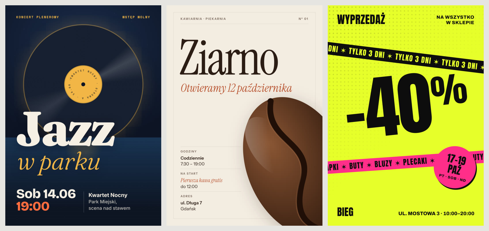
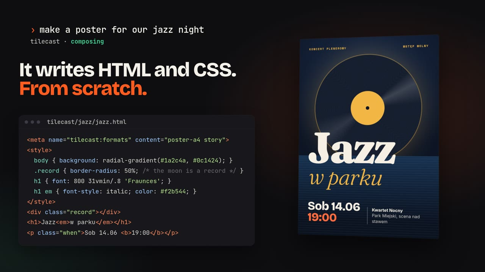
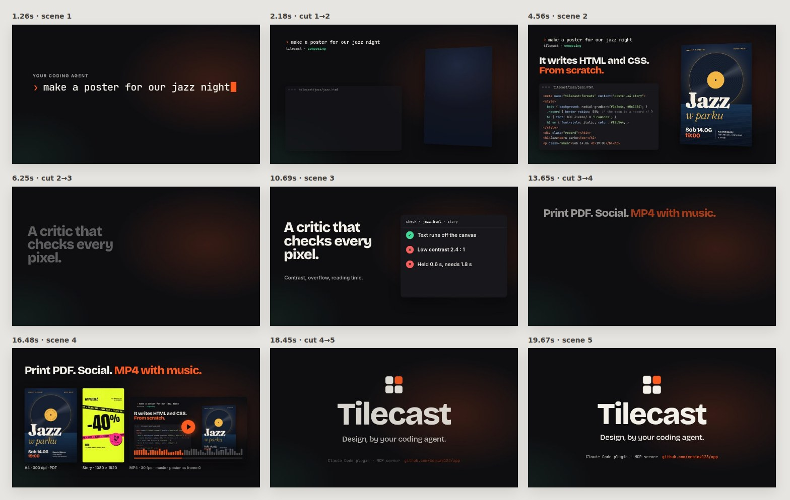
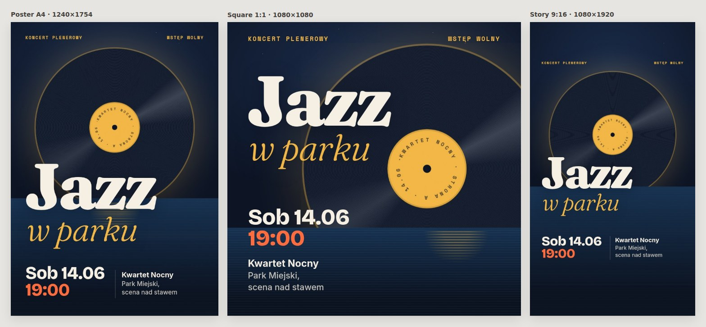
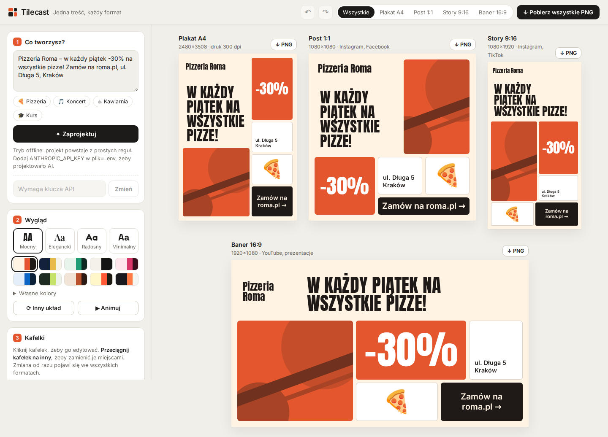

# Tilecast

**Plakaty, ogłoszenia, posty i filmy promocyjne, które Twój agent AI projektuje od zera.** Tilecast to serwer MCP, skill i plugin do Claude Code. Działa też z Codex, Cursorem i każdym innym klientem MCP.

Nie ma tu szablonów. Agent pisze każdą grafikę tak, jak pisze stronę internetową: jeden plik HTML/CSS skomponowany pod tę jedną wiadomość. Tilecast renderuje go w headless Chrome co do piksela i pokazuje agentowi podgląd. Krytyk projektu mierzy kontrast, ucięty tekst i czas czytania. Na koniec Tilecast eksportuje plakat do druku w 300 dpi (PNG + PDF), grafiki do social mediów i wideo MP4 z muzyką.

Sposób pracy przy wideo (plan, hook w pierwszych 2 sekundach, czas na przeczytanie każdej linijki, klatka-okładka jako klatka 0) jest wzorowany na [/brag](https://github.com/latent-spaces/brag).



## Pokaz

**Wideo launchowe** ([`examples/launch`](examples/launch)): 20 sekund, 1920×1080, muzyka i efekty zgrane z bitem. Agent zrobił je tymi samymi narzędziami, które opisuje ten plik.

[](docs/launch.mp4)

Tak wygląda podgląd filmu, który dostaje agent: każda scena po uspokojeniu się ruchu i każde cięcie w połowie przejścia.



**Jeden projekt, wiele formatów.** Kompozycja używa jednostek względnych i `@media (aspect-ratio …)`, więc ten sam plik daje plakat A4, post 1:1 i story 9:16, a każdy format jest osobno skomponowany.



**Test na świeżym agencie.** Czysta sesja Claude Code z zainstalowanym pluginem dostała tylko zlecenie: „Zrób plakat A4 i post kwadratowy na warsztaty ceramiki: sobota 18 października, 11:00–15:00, Pracownia Glina, ul. Ogrodowa 12, Poznań. Koszt 120 zł, materiały w cenie. Zapisy: glina.pl. Wyrenderuj gotowe pliki.” Agent sam napisał plan i kompozycję, poprawił kontrast wskazany przez krytyka, wyrenderował PNG, PDF i tekst do posta. Zajęło mu to 18 kroków i około 2,5 minuty.


Wydarzenia, kawiarnia, pracownia i sklep w przykładach są fikcyjne.

## Jak to działa

1. **Plan.** Skill prowadzi agenta jak brag: najpierw fakty (tylko te podane przez użytkownika), jeden pomysł, hierarchia, paleta, a przy wideo storyboard z czasami scen i budżetem czytania.
2. **Kompozycja od zera.** Agent pisze `tilecast/<nazwa>/<nazwa>.html`: zwykłą stronę z CSS, SVG, gradientami, maskami i animacjami. Fonty są wbudowane, ikony pochodzą z Lucide, a muzykę i efekty generuje Tilecast.
3. **`preview`.** Agent dostaje obraz: wszystkie formaty obok siebie albo taśmę klatek filmu.
4. **`check`.** Krytyk sprawdza gotowe piksele i zgłasza problemy do poprawy:
   ```
   FAIL: 2 error(s), 1 warning(s).
     ✗ [story] Low contrast 1.6:1 (needs 3:1, busy background behind it): <em> "w parku"
     ✗ [2.6s] "To zdanie ma dziesięć słów…" is readable for 1.1s but needs ~3.3s (11 words).
     ! [2.2s] "Szybki błysk" flashes by (0.3s). Hold it or drop it.
   ```
5. **`render_image` / `render_video`.** PNG w pełnej rozdzielczości i PDF w dokładnym formacie papieru, albo MP4 (H.264 + AAC) z najlepszą klatką jako klatką 0. Dzięki temu miniatura na każdej platformie pokazuje najlepszy moment, a nie czarny ekran.

## Instalacja

Potrzebny jest Node.js 20+ oraz Chrome, Chromium albo Edge. Do wideo potrzebny jest ffmpeg. Jeśli go nie ma, Tilecast przy pierwszym renderze pobierze statyczną wersję z npm do folderu cache.

### Claude Code: plugin (serwer MCP + skill)

```
/plugin marketplace add xeniak123/app
/plugin install tilecast@tilecast
```

Potem wystarczy napisać np. „zrób plakat na koncert jazzowy w sobotę o 19:00 w Parku Miejskim, wstęp wolny” albo „zrób wideo launchowe tego projektu”.

### Claude Code: sam serwer MCP

```bash
git clone https://github.com/xeniak123/app tilecast
claude mcp add tilecast -- node "$(pwd)/tilecast/plugin/server/tilecast-mcp.mjs"
```

### Codex

```bash
git clone https://github.com/xeniak123/app tilecast
codex mcp add tilecast -- node "$(pwd)/tilecast/plugin/server/tilecast-mcp.mjs"
mkdir -p ~/.codex/skills && cp -r tilecast/plugin/skills/tilecast ~/.codex/skills/
```

Zamiast `codex mcp add` możesz dopisać serwer ręcznie w `~/.codex/config.toml`:

```toml
[mcp_servers.tilecast]
command = "node"
args = ["/pełna/ścieżka/tilecast/plugin/server/tilecast-mcp.mjs"]
```

### Cursor i inne klienty MCP

```json
{
  "mcpServers": {
    "tilecast": {
      "command": "node",
      "args": ["/pełna/ścieżka/tilecast/plugin/server/tilecast-mcp.mjs"]
    }
  }
}
```

Agenci bez obsługi skilli dostają cały poradnik przez narzędzie `guide`, a skrócony kontrakt kompozycji serwer wysyła w swoich instrukcjach MCP. Jeśli repozytorium jest publiczne, zamiast klonowania możesz użyć `npx -y github:xeniak123/app` jako komendy serwera.

## Narzędzia MCP

| Narzędzie | Co robi |
| --- | --- |
| `preview` | obraz kompozycji: formaty obok siebie albo taśma klatek filmu (sceny i cięcia) + szybka ocena krytyka |
| `check` | krytyk: tekst poza kadrem, ucięty albo zasłonięty, kolizje, za mały tekst, kontrast mierzony na pikselach (także na zdjęciach i gradientach), brakujące fonty i obrazki, zasoby z sieci, błędy skryptów; w wideo czas czytania każdej linijki, błyski, pusty początek lub koniec, brak dźwięku i propozycja klatki-okładki |
| `render_image` | PNG każdego formatu (A4/A3/A5 w 300 dpi + PDF w wymiarze papieru, social w natywnym rozmiarze) |
| `render_video` | MP4 30 fps z miksem ścieżek `<audio data-tilecast>` wyrównanym do -14 LUFS, kolory BT.709, okładka jako klatka 0 i osobny `.jpg`; `quality: "draft"` renderuje szybką wersję w połowie rozmiaru |
| `assets` | `list_fonts`, `find_icons` / `get_icons` (1854 ikony Lucide jako SVG), `make_music` (podkład z siatką beatów), `analyze_music` (beaty i mocne momenty Twojego utworu), `make_sfx` (whoosh, riser, impact…), `list_sfx` / `add_sfx` (efekty CC0), `list_formats` |
| `guide` | poradnik: workflow, design, ruch, tony, audio, runtime |

Formaty: `poster-a4` (1240×1754 → 2480×3508), `poster-a3`, `flyer-a5`, `square` (1080×1080), `portrait` (1080×1350), `story` (1080×1920), `landscape` (1920×1080), `og` (1200×630 → 2400×1260) albo dowolny `SZEROKOŚĆxWYSOKOŚĆ`, np. `1500x500`.

## Kontrakt kompozycji

```html
<meta name="tilecast:formats" content="poster-a4 square story">
<meta name="tilecast:duration" content="18">          <!-- tylko wideo -->
<meta name="tilecast:scenes" content="0 2.03 6.1 12.2 16.3">
<meta name="tilecast:poster" content="5.4">
...
<audio data-tilecast src="audio/music.wav" data-start="0" data-volume="0.8"></audio>
<script>
  tilecast.onFrame((t) => { licznik.textContent = Math.round(tilecast.tween(7, 1.4, 0, 12480, 'outExpo')); });
</script>
```

- **Czas jest wirtualny.** Animacje CSS, Web Animations, `requestAnimationFrame`, timery, `Date` i `performance.now` idą za zegarem renderu, więc każda klatka jest czystą funkcją czasu. Tilecast może renderować klatki równolegle i skoczyć od razu do dowolnego momentu.
- **Fonty** (21 rodzin na licencji OFL, z polskimi znakami) działają offline po samej nazwie: Inter, Bricolage Grotesque, Fraunces, Instrument Serif, Anton, Bebas Neue, Space Grotesk, JetBrains Mono i inne.
- **Tekst dekoracyjny** (np. kod w tle, powtarzany napis) oznacza się `aria-hidden="true"`, a krytyk go pomija.
- Pełny opis: [`plugin/skills/tilecast/references/runtime.md`](plugin/skills/tilecast/references/runtime.md).

## Muzyka i dźwięk

`make_music` generuje podkład dokładnie na długość filmu w jednym z pięciu stylów: `upbeat`, `chill`, `cinematic`, `driving`, `minimal`. Zwraca też siatkę beatów i mocne momenty: start, drop (tu wchodzi odsłona), powrót po przerwie i finałowe uderzenie (tu ląduje logo). Agent montuje film pod te momenty, jak brag. Wszystko powstaje w syntezatorze w kodzie, więc wolno tego używać bez żadnych licencji. Ten sam `seed` daje ten sam utwór.

Masz własny utwór? `analyze_music` znajduje jego tempo, beaty, początki taktów, krzywą energii i mocne momenty (drop, powrót bitu, najmocniejsze uderzenia) i zapisuje je obok pliku, więc film montuje się pod prawdziwą piosenkę tak samo jak pod wygenerowaną.

`make_sfx` generuje efekty (whoosh, swipe, riser, impact, sub-drop, pop, tick, shimmer), a `add_sfx` kopiuje nagrane efekty Kenney (CC0). Render miksuje wszystkie ścieżki, mierzy głośność całości i wyrównuje ją do -14 LUFS, na tym poziomie grają YouTube, Instagram i TikTok. Szczyty trzyma poniżej -1 dBTP, żeby nic się nie przesterowało. Przykładowy film: miks -16,4 LUFS, gotowe MP4 -14,3 LUFS, szczyt -1,1 dBTP.

## Przykłady

| Folder | Co pokazuje |
| --- | --- |
| [`examples/jazz`](examples/jazz) | nocny plakat koncertu: księżyc jako płyta winylowa, tekst po okręgu w SVG, A4 + post + story |
| [`examples/ziarno`](examples/ziarno) | elegancki, redakcyjny plakat otwarcia kawiarni (ton `polished`) |
| [`examples/wyprzedaz`](examples/wyprzedaz) | głośna wyprzedaż (ton `chaotic`): obrócone taśmy, naklejka, raster |
| [`examples/launch`](examples/launch) | wideo launchowe z planem (`plan.md`), muzyką, efektami i tekstem do posta (`share-copy.txt`) |

Żeby wyrenderować przykład, poproś agenta o `render_image` albo `render_video` dla danego pliku. Wyniki trafiają do `export/` obok kompozycji.

## Zmienne środowiskowe (opcjonalne)

- `TILECAST_PROJECT_DIR`: folder projektu. Domyślnie `CLAUDE_PROJECT_DIR`, a gdy go brak, bieżący katalog. Kompozycje i wyniki renderu muszą leżeć w nim.
- `TILECAST_CHROME`: ścieżka do przeglądarki, jeśli nie zostanie znaleziona automatycznie.
- `TILECAST_FFMPEG`: ścieżka do ffmpeg. `TILECAST_NO_DOWNLOAD=1` wyłącza automatyczne pobieranie.
- `TILECAST_CACHE`: folder cache (domyślnie `~/.cache/tilecast`, a w pluginie folder danych pluginu).

## Ograniczenia

- Muzyka z `make_music` to prosty syntezator. Brzmi jak porządny podkład, ale nie zastąpi utworu od kompozytora. Można podać własny plik.
- Szybkość renderu zależy od komputera. Przykładowy film (20 s, 1080p, ciężkie efekty) renderuje się około 45 sekund na 4 rdzeniach bez GPU: klatki łapie kilka procesów przeglądarki naraz. Prostsze kompozycje są szybsze.
- PDF nie ma spadów. Jeśli drukarnia ich wymaga, trzeba rozciągnąć tła poza kadr i powiedzieć o tym drukarni.
- Krytyk mierzy to, co da się zmierzyć: czytelność, układ i czas czytania. Oceny, czy projekt jest dobry, nie zastąpi, dlatego skill każe agentowi oglądać każdy podgląd.

## Tilecast Studio (edytor kafelków)

W repozytorium jest też starszy edytor w przeglądarce, w którym grafikę układa się z kafelków myszką. Nie jest potrzebny do pracy z agentem.

```bash
npm install
npm run dev   # http://localhost:5173
```



## Rozwój

| Polecenie | Co robi |
| --- | --- |
| `npm test` | testy: silnik (wirtualny czas, sceny, skala), krytyk, narzędzia MCP, render wideo z dźwiękiem, syntezator, spakowany serwer przez stdio |
| `npm run typecheck` | sprawdzenie typów |
| `npm run build:mcp` | przebudowanie `plugin/server/tilecast-mcp.mjs` (serwer, fonty, ikony, efekty i poradnik w jednym pliku) oraz `THIRD_PARTY_NOTICES.md`. Uruchom je po zmianach w `mcp/` albo w skillu i zacommituj wynik |

```
mcp/            serwer MCP: przeglądarka (DevTools), runtime z wirtualnym czasem, krytyk,
                render obrazów i wideo, ffmpeg, syntezator muzyki, fonty, ikony, efekty
plugin/         plugin Claude Code: manifest, .mcp.json, skill z poradnikami, spakowany serwer
examples/       przykładowe kompozycje (plakaty i wideo)
src/, server/   Tilecast Studio (edytor kafelków)
```

## Podziękowania i licencje

- Sposób pracy przy wideo, zasady i tony są adaptacją [/brag](https://github.com/latent-spaces/brag) autorstwa Shunit Haviv Hakimi (licencja MIT).
- Nagrane efekty dźwiękowe: [Kenney](https://kenney.nl) (CC0).
- Ikony: [Lucide](https://lucide.dev) (ISC). Fonty: [Fontsource](https://fontsource.org) (SIL Open Font License).
- Pełna lista licencji wbudowanych pakietów: [`plugin/server/THIRD_PARTY_NOTICES.md`](plugin/server/THIRD_PARTY_NOTICES.md).
